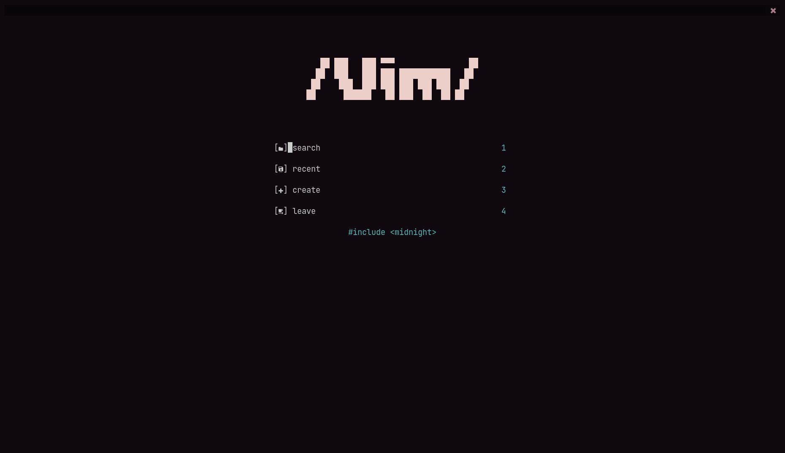
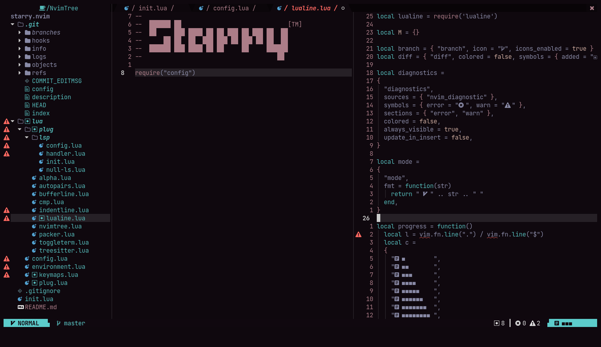
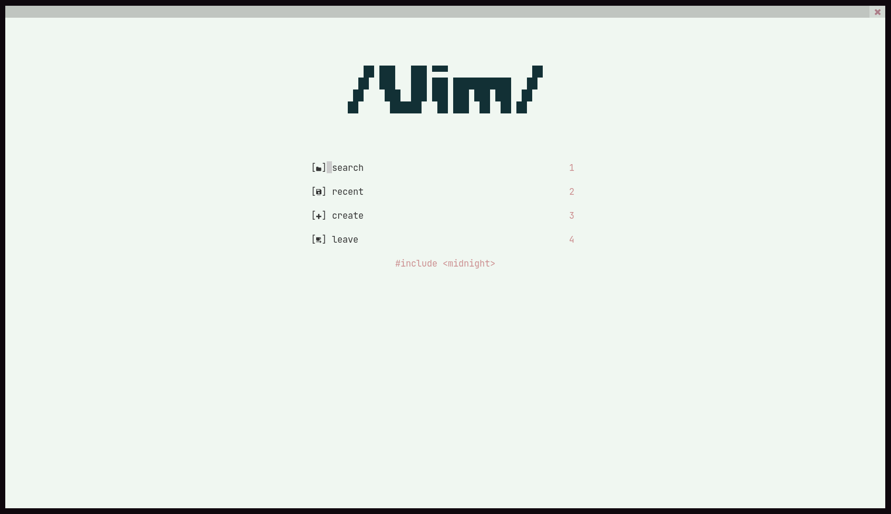
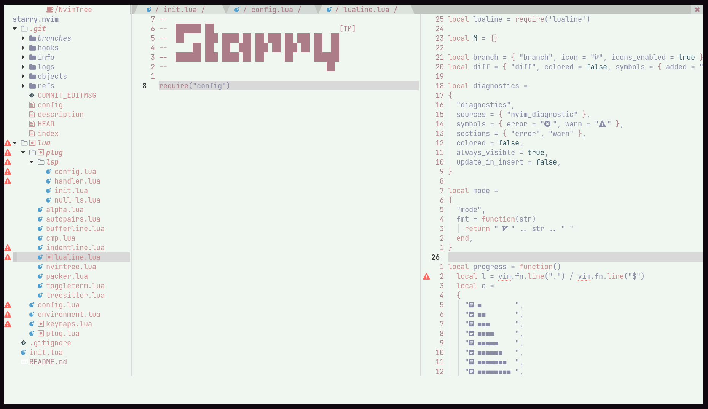

# starry.nvim

## [📔] about
starry.nvim is a neovim template, offers the basics for a cozy and solid developing experience, which can be improved building on top of it

## [⚙] features
- ready to go auto-completion and diagnostics
- easy to build on top of it
- pre set keys for easier navigation
- custom colorscheme with dark and light modes

## [📦] installation

#### copy and run the installation script
```sh
bash <(curl -S https://raw.githubusercontent.com/TheMidnightShow/starry.nvim/master/install.sh) 
```

## [📺] preview

### starry_nebula theme



### starry_nova theme


